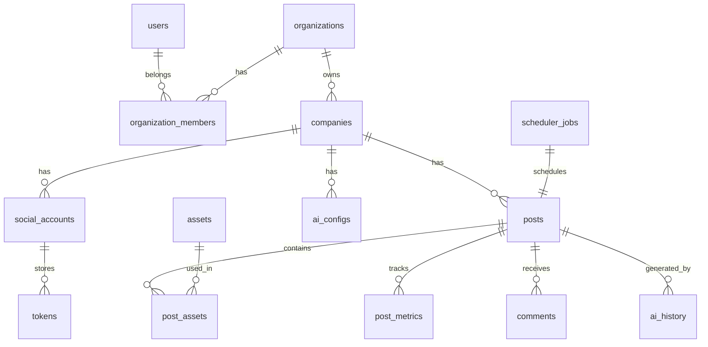

# Esquema de base de datos — Social AI Manager

> **Fase 2 completada.** 17 tablas implementadas con SQLAlchemy + Alembic.

---

## Migraciones

| Revisión | Descripción |
|----------|-------------|
| `f5d5a32a2f19` | Esquema inicial — todas las tablas |

```bash
# Local / Docker
docker compose exec backend alembic upgrade head

# Coolify: automático con RUN_MIGRATIONS=true
```

---
## Diagrama ER (simplificado)



---

## Tablas

### `users`

| Columna | Tipo | Descripción |
|---------|------|-------------|
| id | UUID PK | |
| email | VARCHAR UNIQUE | |
| password_hash | VARCHAR | bcrypt |
| full_name | VARCHAR | |
| role | ENUM | admin, editor, operator, readonly |
| is_active | BOOLEAN | |
| created_at | TIMESTAMPTZ | |
| updated_at | TIMESTAMPTZ | |

### `organizations`

| Columna | Tipo | Descripción |
|---------|------|-------------|
| id | UUID PK | |
| name | VARCHAR | |
| slug | VARCHAR UNIQUE | |
| plan | VARCHAR | free, pro, enterprise |
| credits_balance | INTEGER | Créditos IA |
| created_at | TIMESTAMPTZ | |

### `organization_members`

| Columna | Tipo | Descripción |
|---------|------|-------------|
| id | UUID PK | |
| organization_id | UUID FK | |
| user_id | UUID FK | |
| role | ENUM | admin, editor, operator, readonly |

### `companies`

| Columna | Tipo | Descripción |
|---------|------|-------------|
| id | UUID PK | |
| organization_id | UUID FK | |
| name | VARCHAR | |
| logo_url | VARCHAR | |
| website | VARCHAR | |
| brand_description | TEXT | |
| tone | VARCHAR | formal, casual, professional... |
| language | VARCHAR | es, en, pt... |
| colors | JSONB | { primary, secondary, accent } |
| target_audience | TEXT | |
| location | VARCHAR | |
| products | JSONB | |
| services | JSONB | |
| custom_hashtags | TEXT[] | |
| forbidden_words | TEXT[] | |
| created_at | TIMESTAMPTZ | |

### `social_accounts`

| Columna | Tipo | Descripción |
|---------|------|-------------|
| id | UUID PK | |
| company_id | UUID FK | |
| network | ENUM | instagram, facebook, linkedin... |
| external_account_id | VARCHAR | ID en la red |
| username | VARCHAR | |
| display_name | VARCHAR | |
| profile_picture_url | VARCHAR | |
| is_connected | BOOLEAN | |
| connected_at | TIMESTAMPTZ | |
| metadata | JSONB | page_id, etc. |

### `tokens`

| Columna | Tipo | Descripción |
|---------|------|-------------|
| id | UUID PK | |
| social_account_id | UUID FK | |
| access_token_encrypted | TEXT | AES-256 |
| refresh_token_encrypted | TEXT | AES-256 |
| expires_at | TIMESTAMPTZ | |
| last_refreshed_at | TIMESTAMPTZ | |

### `posts`

| Columna | Tipo | Descripción |
|---------|------|-------------|
| id | UUID PK | |
| company_id | UUID FK | |
| social_account_id | UUID FK | |
| type | ENUM | image, carousel, reel, video, story, text |
| status | ENUM | draft, scheduled, publishing, published, failed |
| title | VARCHAR | |
| caption | TEXT | |
| hashtags | TEXT[] | |
| cta | VARCHAR | |
| scheduled_at | TIMESTAMPTZ | |
| published_at | TIMESTAMPTZ | |
| external_post_id | VARCHAR | ID en la red |
| permalink | VARCHAR | |
| error_message | TEXT | |
| retry_count | INTEGER | |
| ai_config | JSONB | { text: "claude", image: "openai", ... } |
| created_at | TIMESTAMPTZ | |

### `assets`

| Columna | Tipo | Descripción |
|---------|------|-------------|
| id | UUID PK | |
| company_id | UUID FK | |
| type | ENUM | image, video, audio |
| url | VARCHAR | |
| filename | VARCHAR | |
| mime_type | VARCHAR | |
| width | INTEGER | |
| height | INTEGER | |
| size_bytes | BIGINT | |
| ai_provider | VARCHAR | |
| ai_model | VARCHAR | |
| ai_prompt | TEXT | |
| ai_cost | DECIMAL | |
| ai_duration_ms | FLOAT | |
| metadata | JSONB | |
| created_at | TIMESTAMPTZ | |

### `post_assets`

| Columna | Tipo | Descripción |
|---------|------|-------------|
| post_id | UUID FK | |
| asset_id | UUID FK | |
| sort_order | INTEGER | |

### `post_metrics`

| Columna | Tipo | Descripción |
|---------|------|-------------|
| id | UUID PK | |
| post_id | UUID FK | |
| likes | INTEGER | |
| comments | INTEGER | |
| saves | INTEGER | |
| shares | INTEGER | |
| reach | INTEGER | |
| impressions | INTEGER | |
| engagement_rate | DECIMAL | |
| ctr | DECIMAL | |
| fetched_at | TIMESTAMPTZ | |

### `comments`

| Columna | Tipo | Descripción |
|---------|------|-------------|
| id | UUID PK | |
| post_id | UUID FK | |
| external_comment_id | VARCHAR | |
| author_username | VARCHAR | |
| text | TEXT | |
| status | ENUM | pending, replied, hidden, flagged, deleted |
| reply_text | TEXT | |
| replied_at | TIMESTAMPTZ | |
| ai_replied | BOOLEAN | |
| created_at | TIMESTAMPTZ | |

### `prompts`

| Columna | Tipo | Descripción |
|---------|------|-------------|
| id | UUID PK | |
| company_id | UUID FK | |
| name | VARCHAR | |
| template | TEXT | |
| variables | JSONB | |
| category | VARCHAR | |

### `ai_history`

| Columna | Tipo | Descripción |
|---------|------|-------------|
| id | UUID PK | |
| post_id | UUID FK NULL | |
| company_id | UUID FK | |
| provider | VARCHAR | |
| model | VARCHAR | |
| capability | VARCHAR | text, image, video |
| prompt | TEXT | |
| response | TEXT | |
| cost | DECIMAL | |
| duration_ms | FLOAT | |
| tokens_used | INTEGER | |
| created_at | TIMESTAMPTZ | |

### `ai_configs`

| Columna | Tipo | Descripción |
|---------|------|-------------|
| id | UUID PK | |
| company_id | UUID FK | |
| text_provider | VARCHAR | |
| text_model | VARCHAR | |
| image_provider | VARCHAR | |
| image_model | VARCHAR | |
| hashtag_provider | VARCHAR | |
| ideas_provider | VARCHAR | |

### `scheduler_jobs`

| Columna | Tipo | Descripción |
|---------|------|-------------|
| id | UUID PK | |
| post_id | UUID FK | |
| celery_task_id | VARCHAR | |
| status | ENUM | pending, running, completed, failed |
| scheduled_for | TIMESTAMPTZ | |
| started_at | TIMESTAMPTZ | |
| completed_at | TIMESTAMPTZ | |
| error | TEXT | |

### `logs`

| Columna | Tipo | Descripción |
|---------|------|-------------|
| id | UUID PK | |
| category | ENUM | api, ai, social, scheduler, auth, error, audit |
| action | VARCHAR | |
| user_id | UUID FK NULL | |
| company_id | UUID FK NULL | |
| metadata | JSONB | |
| error | TEXT | |
| duration_ms | FLOAT | |
| cost | DECIMAL | |
| created_at | TIMESTAMPTZ | |

---

## Índices recomendados

- `posts(company_id, status, scheduled_at)` — scheduler
- `posts(social_account_id, status)` — dashboard
- `comments(post_id, status)` — inbox
- `logs(created_at, category)` — auditoría
- `ai_history(company_id, created_at)` — costos IA
